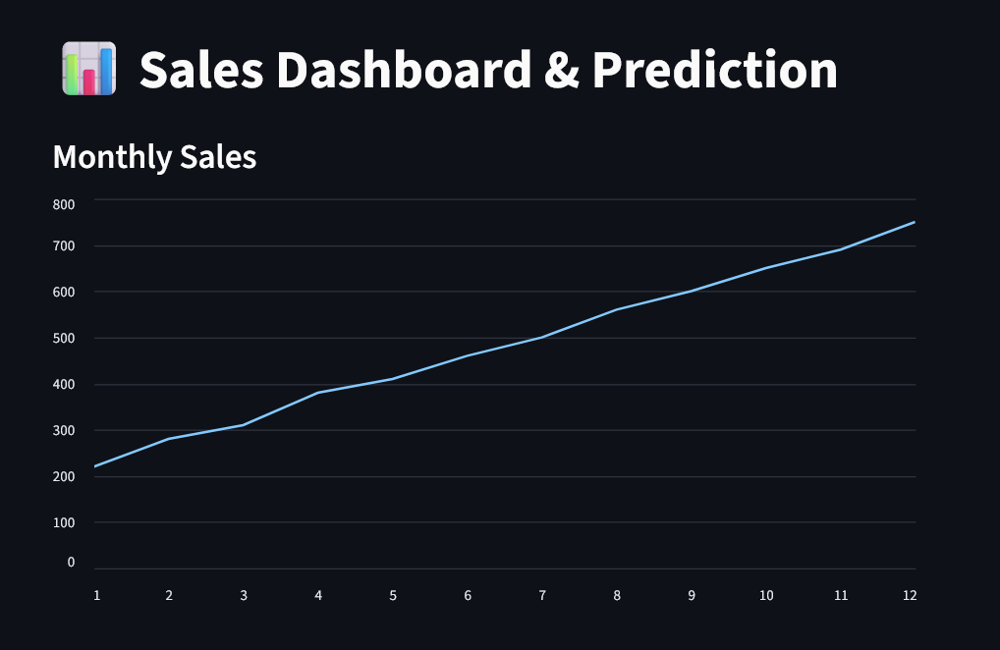

# Sales Analytics & Forecasting Dashboard

## Overview
This project is a Business Intelligence dashboard designed to analyze sales data and provide future sales predictions using machine learning.

## Problem
Many businesses have raw sales data but lack insights for decision-making.

## Solution
This system provides:
- Sales visualization
- Product & region analysis
- Sales forecasting
- Business insights

## Tech Stack
- Python
- Streamlit
- Pandas
- Scikit-learn

## Key Features
- Interactive dashboard
- Sales trend analysis
- Top product identification
- Next month sales prediction

## Impact
Helps businesses make data-driven decisions and improve strategy planning

## Dashboard Preview

